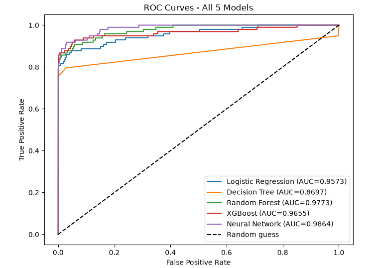

# 💳 Credit Card Fraud Detection

An end-to-end ML system that detects fraudulent credit card transactions — from model training through a deployed, publicly usable API and demo app.

🔗 **[Live Demo](https://fraud-detector-pzpgvrsqjkrgq5tx5yy5gv.streamlit.app/)** | 📄 **[API Docs](https://fraud-detector-tgvf.onrender.com/docs)**

> Note: the API runs on Render's free tier, so the first request after inactivity can take 30-50 seconds to wake up.

## Problem

Credit card fraud detection is a highly imbalanced classification problem — in this dataset of 284,807 transactions, only **492 (0.17%) are fraudulent**. A model that predicts "not fraud" for every transaction would be 99.8% accurate and completely useless, which is why this project focuses on precision, recall, and F1 rather than accuracy alone.

## Models Compared

Five models were trained and evaluated on a held-out validation set:

| Model | Precision (Fraud) | Recall (Fraud) | F1 (Fraud) | AUC |
|-------|-----|-----|-----|-----|
| Logistic Regression | 0.8267 | 0.6327 | 0.7168 | 0.9573 |
| Decision Tree | 0.8202 | 0.7449 | 0.7807 | 0.8824 |
| Random Forest | **0.9241** | 0.7449 | **0.8249** | **0.9773** |
| XGBoost | 0.7857 | 0.7857 | 0.7857 | 0.9655 |
| Neural Network |0.0897 | 0.8673 | 0.1626 | 0.9841 |

**Random Forest performed best** and was selected for deployment — it had the highest precision by a wide margin (92.4%, meaning very few false alarms) while still catching nearly 75% of actual fraud, and the highest AUC (0.9773) of all five models.



**Final test set performance (Random Forest, evaluated once on held-out test data):**
[fill in from your X_test/y_test run]

## Key Findings (Error Analysis)

[Paste your Day 5 write-up here — the false negative/positive patterns you found, e.g. amount ranges, probability distributions]

## Why Tree-Based Models Over Deep Learning

Neural networks are often assumed to be the strongest choice for any ML problem, but for structured/tabular data like this, tree-based ensembles are a well-established strong baseline and frequently outperform neural networks — this project deliberately trained a neural network alongside the classical models to test that directly rather than assume it. [Update this line once the neural network's numbers are filled in above, to state the actual outcome.]

## Architecture
Raw Transaction Data
↓
Feature Scaling (StandardScaler)
↓
Random Forest Model (scikit-learn)
↓
FastAPI (prediction endpoint + validation)
↓
Docker (containerized for consistent deployment)
↓
Render (hosting) + Streamlit (frontend demo)


## Tech Stack

**ML:** Python, scikit-learn, XGBoost, TensorFlow/Keras, pandas, NumPy
**Backend:** FastAPI, Pydantic, Docker
**Deployment:** Render, Streamlit Community Cloud
**Dataset:** [Credit Card Fraud Detection (Kaggle)](https://www.kaggle.com/datasets/mlg-ulb/creditcardfraud)

## Running Locally

```bash
git clone https://github.com/saipavanmaguluri-glitch/fraud-detector.git
cd fraud-detector
python3 -m venv venv
source venv/bin/activate
pip install -r requirements.txt
uvicorn app.main:app --reload
```
Visit `http://127.0.0.1:8000/docs` to test the API.

## Project Structure
fraud-detector/
├── app/ # FastAPI application
│ ├── main.py # API endpoints
│ ├── model.py # Model loading + prediction logic
│ └── schema.py # Request validation
├── models/ # Trained model + scaler
├── notebooks/ # EDA and model training
├── streamlit_app.py # Frontend demo
├── Dockerfile
└── requirements.txt

